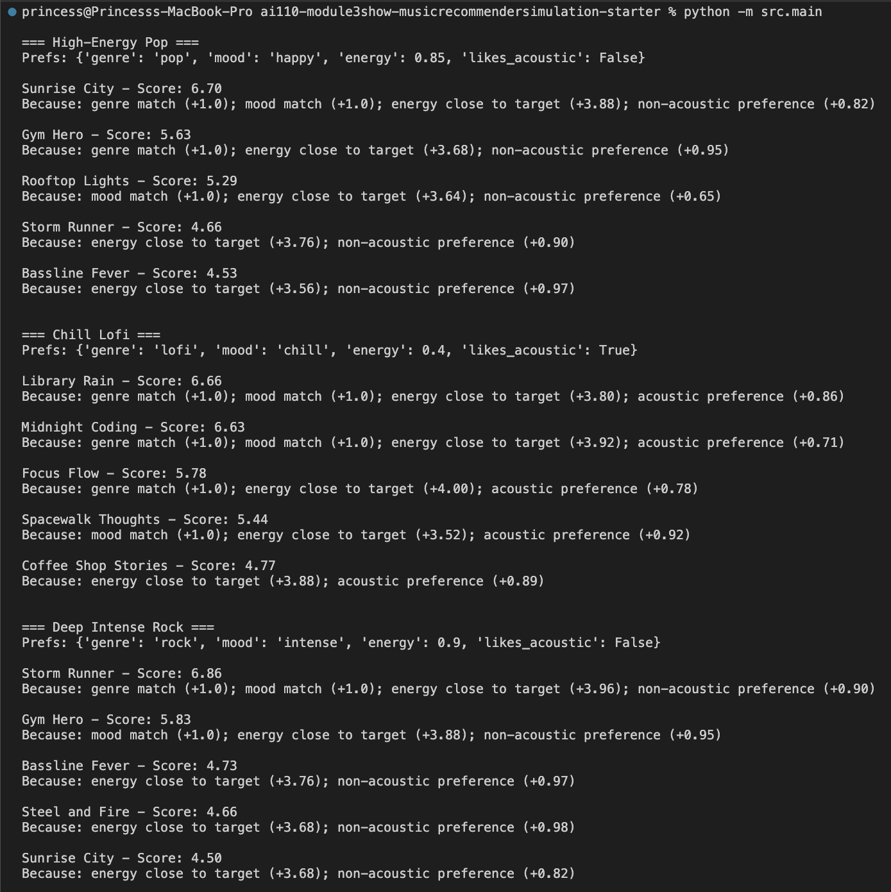

# 🎵 Music Recommender Simulation

## Project Summary

In this project you will build and explain a small music recommender system.

Your goal is to:

- Represent songs and a user "taste profile" as data
- Design a scoring rule that turns that data into recommendations
- Evaluate what your system gets right and wrong
- Reflect on how this mirrors real world AI recommenders

Replace this paragraph with your own summary of what your version does.

---

## How The System Works

Explain your design in plain language.

Some prompts to answer:

- What features does each `Song` use in your system
  - For example: genre, mood, energy, tempo
- What information does your `UserProfile` store
- How does your `Recommender` compute a score for each song
- How do you choose which songs to recommend

You can include a simple diagram or bullet list if helpful.

Real music platforms, such as Spotify and Pandora, use recommendation systems combined with content signals such as track sound and tagging to predict what a listener might enjoy next by combining various types of data. Some systems use collaborative filtering, which examines patterns across multiple users and recommends songs based on similar behavior, whereas others use content-based filtering, which focuses on the song's attributes. This show project uses a content-based approach since there is no community of users, only each song’s attributes and a single taste profile. The recommender will use those features to compute a weighted score for each song, and then return the top songs based on their score. After rating each song, it will rank them from best to worst in order to generate recommendations.

Song: id, title, artist, genre, mood, energy, tempo_bpm, valence, danceability, acousticness

UserProfile: favorite_genre, favorite_mood, target_energy, likes_acoustic

The recommender will use song attributes such as genre, mood, energy, acousticness, and other numeric fields if needed, along with a user profile that stores target preferences. It will score each song by giving weighted points for genre and mood matches and additional points based on how close the numeric features are to the user’s preferences. After that, it will rank the songs by score and return the top k recommendations.

---

## Getting Started

### Setup

1. Create a virtual environment (optional but recommended):
  ```bash
   python -m venv .venv
   source .venv/bin/activate      # Mac or Linux
   .venv\Scripts\activate         # Windows
  ```
2. Install dependencies

```bash
pip install -r requirements.txt
```

1. Run the app:

```bash
python -m src.main
```

### Running Tests

Run the starter tests with:

```bash
pytest
```

You can add more tests in `tests/test_recommender.py`.

---

## Experiments You Tried

Use this section to document the experiments you ran. For example:

- What happened when you changed the weight on genre from 2.0 to 0.5
- What happened when you added tempo or valence to the score
- How did your system behave for different types of users



---

## Limitations and Risks

Summarize some limitations of your recommender.

Examples:

- It only works on a tiny catalog
- It does not understand lyrics or language
- It might over favor one genre or mood

You will go deeper on this in your model card.

---

## Reflection

Read and complete `model_card.md`:

**[Model Card](model_card.md)**

Write 1 to 2 paragraphs here about what you learned:

- about how recommenders turn data into predictions
- about where bias or unfairness could show up in systems like this


- What was your biggest learning moment during this project?

The clearest moment for me was seeing the top 5 list change after I adjusted the weights. The recommendations come from the rules behind the system, not just the data itself, and a small change in what the model values can completely shift the results.

- How did using AI tools help you, and when did you need to double-check them?

AI was helpful for brainstorming user profiles and edge cases I might not have thought of right away. I still had to verify everything against the CSV by checking that numeric values were actually being treated as numbers, that string matches were exact, and that the printed reasons actually matched what the code was doing.

- What surprised you about how simple algorithms can still "feel" like recommendations?

What surprised me most was how quickly the output started to feel believable/trustworthy once each song had a score and a short explanation. Even a basic rule set can seem thoughtful because it lines up with the way people already describe music through genre, mood, and energy, even if the system itself is still basic.

- What would you try next if you extended this project?

Next, I would focus on making the recommender feel more realistic. Right now it can only represent a very narrow version of someone’s taste, so I would want it to handle mixed preferences instead of assuming a person fits into one mood or one genre. I would also add more variety to the top results so the recommendations do not all blend together, and I would bring in more numeric features to make the matching feel more specific.
